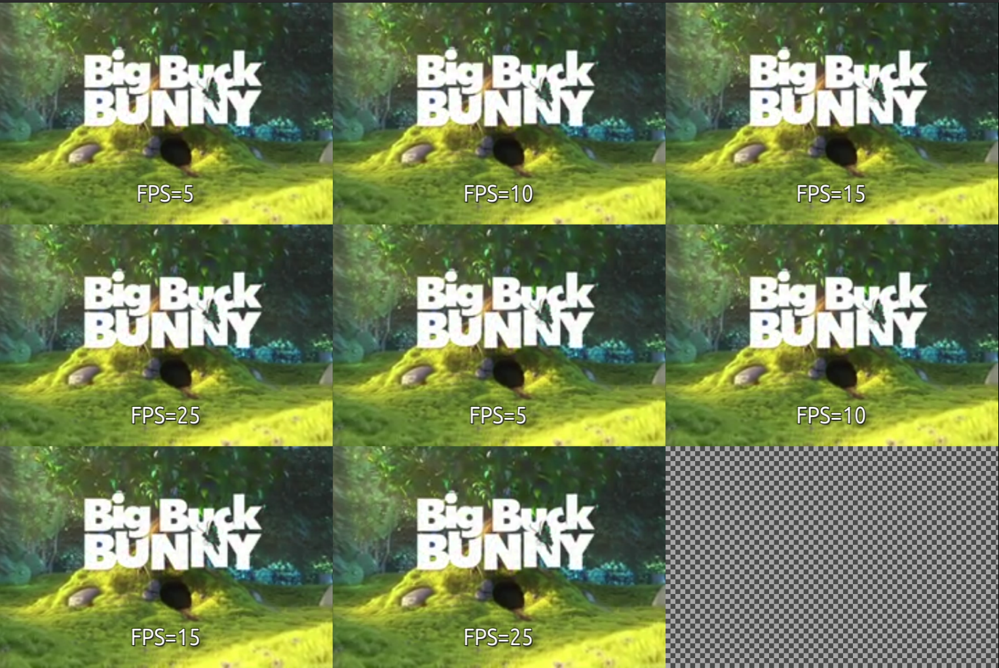

# tileplayer
A simpler multi-video file and stream player based on GStreamer



## Run using docker image (tested on ubuntu)

Build the docker image
```bash
docker build -f dockerfile_x86 -t tileplayer .
```

Give desktop environment access for docker to connect
```bash
xhost +
```

Run docker container
```bash
docker run -it --rm --env="DISPLAY" -v /tmp/.X11-unix:/tmp/.X11-unix tileplayer bash
```

Run tileplayer sample
```bash
# Generate sample config file
tileplayer -g config.yaml

tileplayer -c config.yaml
```

## Issues and future work
1. Add the protocol, latency, and drop-on-latency config per stream
2. FIX: GStreamer critical error. Pipeline is not in NULL state.
3. Add more interesting grid placement.
4. FIX: Warning: .gobject/gsignal.c:2736: instance A has no handler with id B